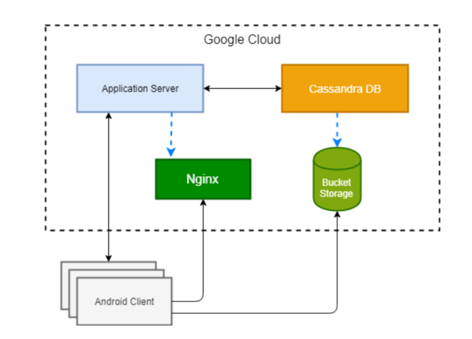
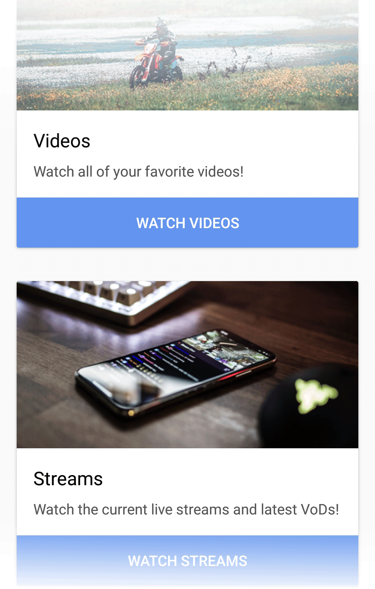
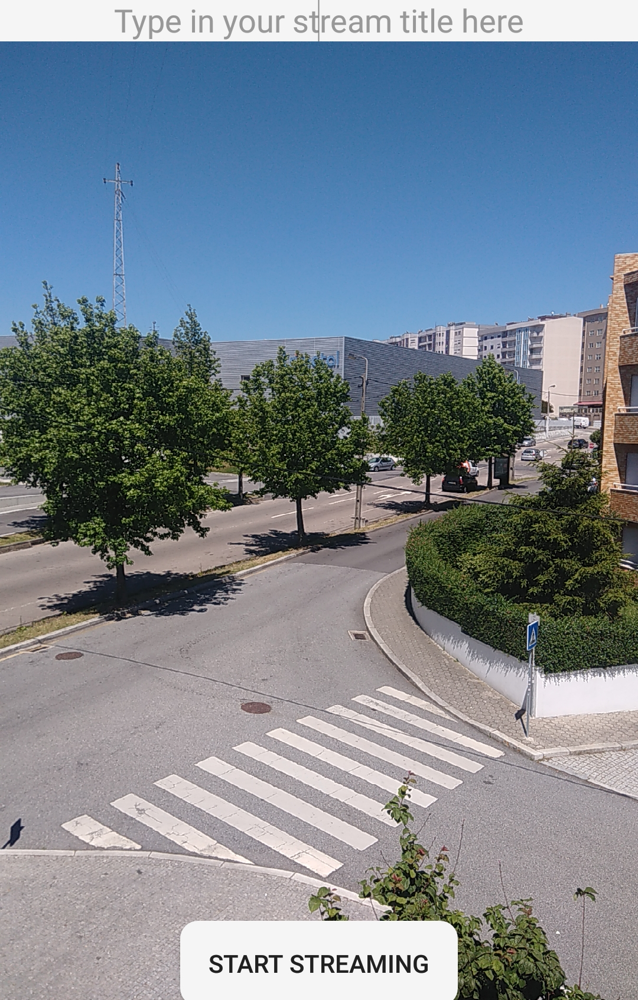
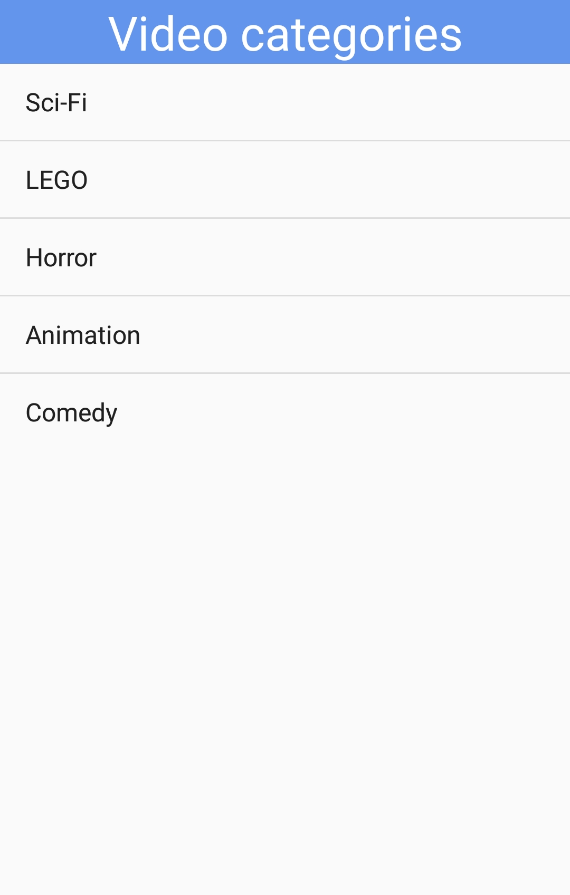

# MCFlix - An android application built for live streaming and watching *video on demand* content

MCFlix is a full-stack application that is divided into two main architecture components: the **client** and the **public cloud**.

<p align="center">

</p>

## Server - [Application server, Nginx, Cassandra DB]

The server application src files are available in the `/server` directory. The compiled server application is designed to be ran on the public cloud, along with the standalone cassandra database and Nginx application.

The database schema is available in `/server/mcflix_schema.cql` and has the following structure:

```
CREATE KEYSPACE mcflix WITH replication = {'class': 'SimpleStrategy', 'replication_factor': '1'}  AND durable_writes = true;

CREATE TABLE mcflix.movies (
    movie_id int PRIMARY KEY,
    category set<text>,
    length_seconds int,
    name text,
    url map<text, text>,
    year int
) WITH bloom_filter_fp_chance = 0.01
    AND caching = {'keys': 'ALL', 'rows_per_partition': 'NONE'}
    (...)
```

Additionally, the database content used in order to test the application is also provided in `/server/movies.csv`. Note that you won't be able to access the video content that the metadata stored in the database refers to, since the content was hosted on a Google Cloud platform bucket storage that was eventually deleted. Nevertheless, feel free to add your own public url entries to the database!

Configuration for the Nginx server is also provided in `/server/nginx.conf`, which hosts an rtmp service that allows for livestreaming content on the android platform.

## Client - [Android application]

The client represents an Android application that sits on a Java implementation of the different activity screens used to communicate with the server in order to retrieve the data related to media content.

The application is divided into the following three main activities: *watching VoD content*, *watching streamed content* and *streaming your won content*.

<p align="center">



</p>

The client application can be built using Android Studio and opening the `/client` folder as the project workspace.
